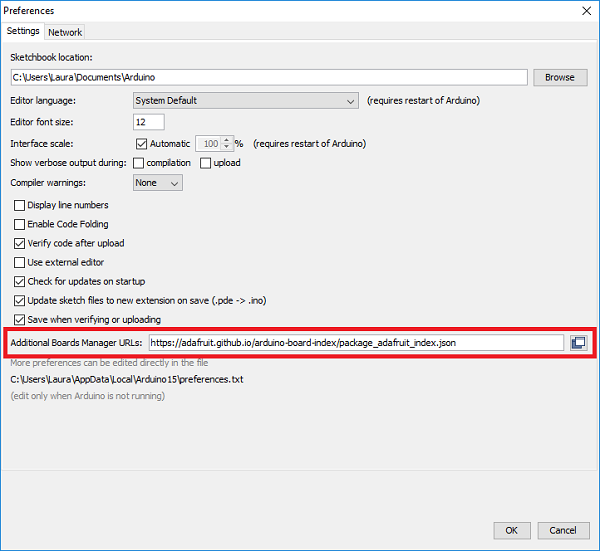
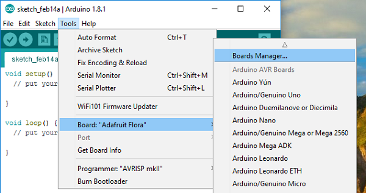
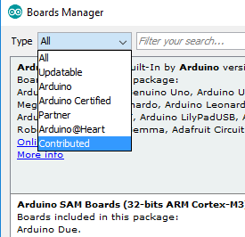
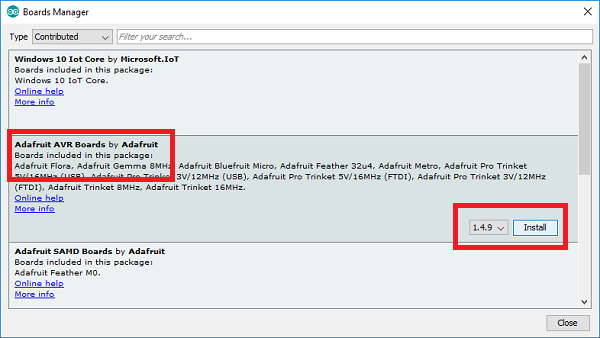
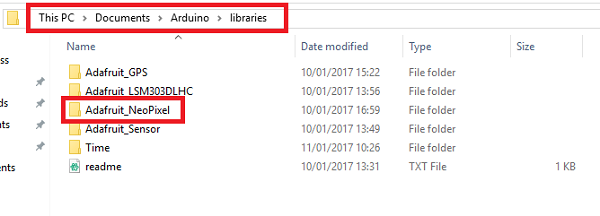

## Getting started with wearables

In this resource you will learn how to create a basic piece of wearable technology using an Adafruit FLORA and a NeoPixel LED.

- Download the Arduino IDE from the [Latest Arduino IDE link](https://learn.adafruit.com/adafruit-arduino-ide-setup/arduino-1-dot-6-x-ide) on the Adafruit website.

- Run the Arduino IDE and click `File` > `Preferences` (or `Arduino` > `Preferences` on Mac OSX)

- A box will pop up. Paste this line into the box labelled "Additional Boards Manager URLs" then click `OK`

  ```bash
  https://adafruit.github.io/arduino-board-index/package_adafruit_index.json
  ```

  

- Now go to `Tools` > `Boards` > `Board manager`

  

- Change the drop down on the top left to `Contributed`

  

- Click on the category entitled **Adafruit AVR boards** and then click the `Install` button.

  

- Close the Arduino IDE and then reopen it.

- Finish the setup for the operating system you are using - [Windows](https://learn.adafruit.com/adafruit-arduino-ide-setup/windows-setup), [Mac OSX](https://learn.adafruit.com/adafruit-arduino-ide-setup/mac-osx-setup) or [Linux](https://learn.adafruit.com/adafruit-arduino-ide-setup/linux-setup)

- Download the Adafruit NeoPixel library by clicking the green button [on the Adafruit NeoPixel page](https://learn.adafruit.com/adafruit-neopixel-uberguide/arduino-library-installation#manually-install-adafruit-neopixel-library).

- Unzip the NeoPixel library into a folder.

- Rename the unzipped folder to `Adafruit_NeoPixel`, being careful to get the capitalisation exactly correct.

- Locate the folder where you installed the Arduino IDE. Copy and paste the whole `Adafruit_NeoPixel` folder into the `libraries` subfolder. For example, we used Windows to create this tutorial and our libraries folder looked like this:

   

