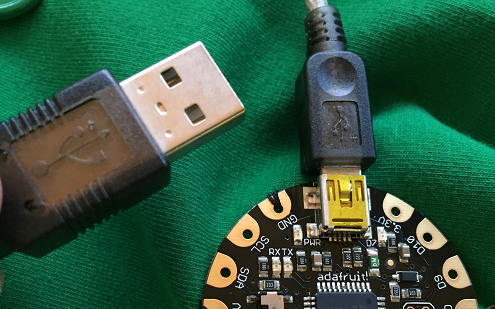
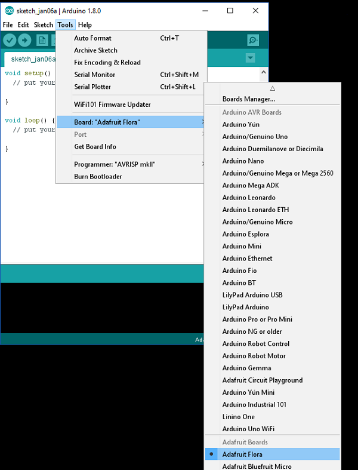
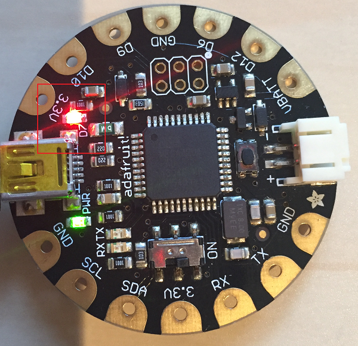
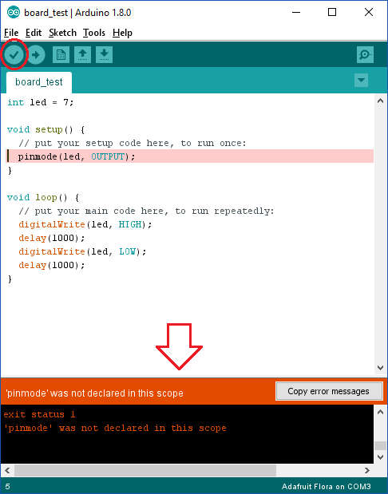

## Testing the FLORA board

We will begin by testing whether we can upload a program successfully to the FLORA board, before we move on to connecting any components.

- Connect your FLORA board to the computer via the USB cable. The smaller end of the cable goes into the FLORA (ours is a FLORA v1 so we used a mini USB cable, but if you have a FLORA v2 or v3 you will need a micro USB cable). The large end of the USB cable should be connected to a USB port on your computer.

   

- Open the Arduino IDE and check that on the Tools menu you have selected "Adafruit FLORA" as the board. On the same menu, look for the "Serial Port" option and select the port. On Windows, this will be labelled COM and then a number greater than 2 (e.g. COM3). On Mac, select a port containing the phrase "usbmodem".

  

- If you look closely at the FLORA board you will see a tiny LED labelled "D7".

  

  Keep the code that is automatically inserted and add the following code into the Arduino IDE to program this LED to blink repeatedly:

  ```cpp
  int led = 7;

  void setup() {
    pinMode(led, OUTPUT);
  }

  void loop() {
    digitalWrite(led, HIGH);
    delay(1000);
    digitalWrite(led, LOW);
    delay(1000);
  }
  ```

- Click on the tick symbol in the top left of the window. This will **compile** your code, which includes checking it for errors. Any errors which you need to correct will appear at the bottom, and the line will often be highlighted in the code to help you. In the example below we have forgotten the capital 'M' in `pinMode` which has caused an error.

  

- If there were any errors, fix them and then press the tick button again. Repeat this until you see "Done compiling" in green at the bottom and no error messages are displayed. You will be asked to type a filename and save your program.

- Now click on the arrow symbol which is next to the tick symbol you pressed earlier. This will **upload** your code to the FLORA. The LEDs will blink whilst the code uploads, and When the code has finished uploading you should see the red LED constantly blinking.

