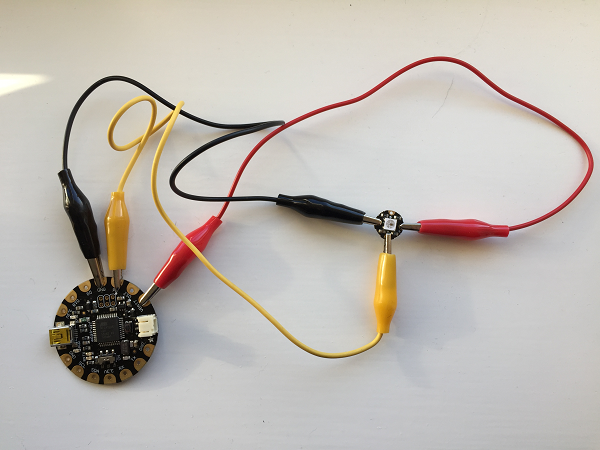
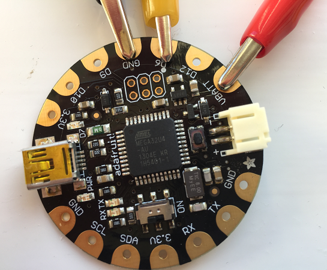
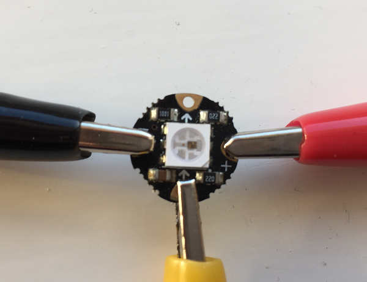

## Testing the circuit
Before sewing anything, it is a good idea to test the circuit with crocodile clips to check that the FLORA and the NeoPixel are working correctly and that they can be programmed. For this you will need:

- a FLORA board
- a NeoPixel
- three crocodile clips
- USB cable

We have chosen to use red, yellow, and black crocodile clips for clarity, but the colour of the wires does not matter.

- Before you continue, **disconnect the USB cable from your FLORA** to remove the power supply. This is important to avoid accidentally causing permanent damage to your NeoPixel.

   

- Connect a crocodile clip from GND on the FLORA to negative (-) on the NeoPixel. This provides your ground connection.

- Connect a crocodile clip from VBATT on the FLORA to positive (+) on the NeoPixel. This provides power to the NeoPixel.

- Connect a crocodile clip from D6 on the FLORA to the connector next to the arrow pointing **towards** the NeoPixel. D6 is a pin (just like the pins on the Raspberry Pi) which we can use to send signals to the NeoPixel.

  

  

- Once all of the crocodile clips are in place, connect your FLORA to the computer using the USB cable.

