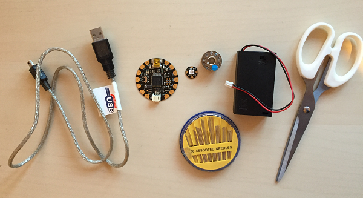
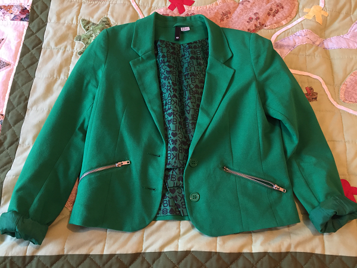

## Sewing it all up

Now it's time to sew your FLORA and NeoPixel onto an item of clothing to make your tech wearable. You can sew it to anything at all from a t-shirt to a pair of shoes, or even a bag! Before you sew, it is important to think about where you will position the components and where you will store your battery pack. Also don't forget that your circuit is not waterproof and could be dangerous if it gets wet, so don't choose anything you are likely to wear in the rain or which is likely to get wet.

To make your first wearable item, make sure you have the following items of kit:

- USB cable
- Adafruit FLORA
- Adafruit NeoPixel
- Conductive thread
- Needle (make sure the eye is small enough to go through the holes on the NeoPixel)
- Battery pack and batteries
- Scissors
- Clear nail varnish (optional)
- Normal sewing thread (optional)

You will also need an item of clothing of your choice.

