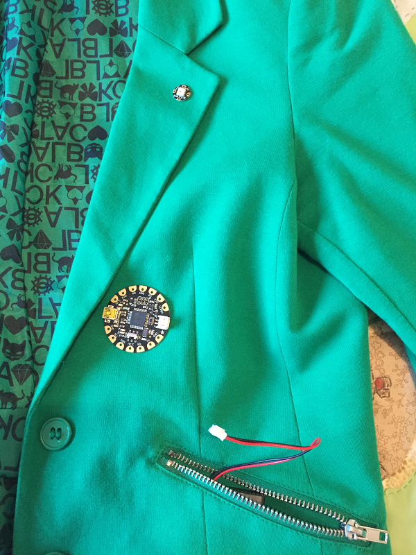
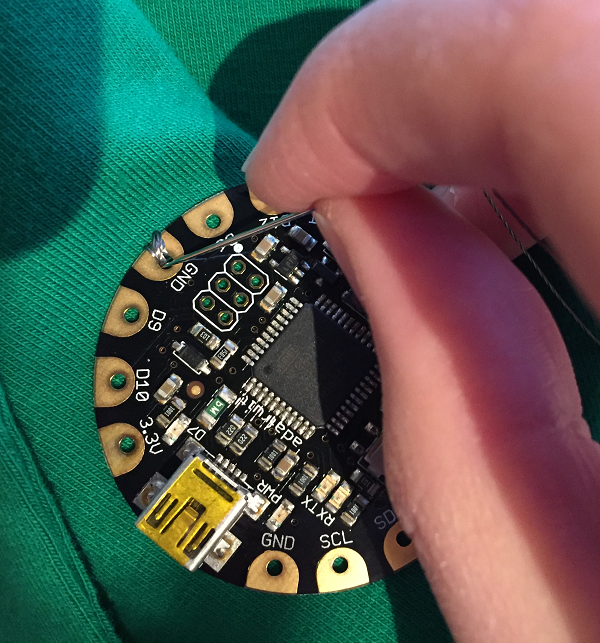
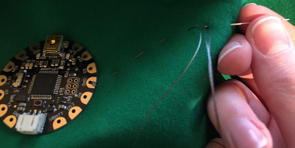
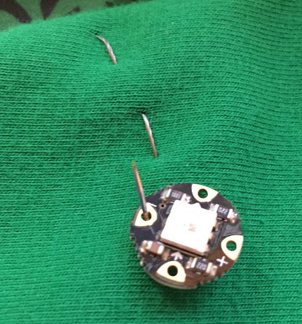
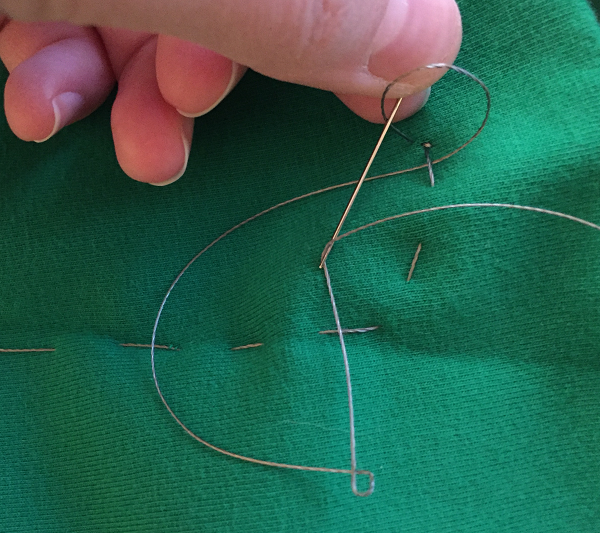

## Sewing the ground connection

- First, plan out where your components will go. I chose this jacket because it has a pocket where I can store the battery pack, and a lapel onto which I could sew the NeoPixel. Most of the thread circuit can also be hidden by stitching under the lapel.

  

  Don't forget to think about the orientation of the FLORA: try to position the pins you will be using (GND, VBATT, and D6) pointing towards the NeoPixel so that you can sew in a relatively straight line.

- Cut off a length of conductive thread. [Adafruit recommend](https://learn.adafruit.com/conductive-thread/prep-thread-and-fabric) using the length of your arm as a guide so that the thread does not become too long and unwieldy to work with.

- Position your FLORA, then sew from the back of the material through the `GND` hole on the FLORA. Leave about 5-10cm of thread at the back (careful not to pull it all the way through). Sew over the top of the connector and back through the fabric. Repeat this a couple more times to create a secure connection around the `GND` pad.

  

- With your needle on the back of the fabric, use the remaining thread and the 5-10cm you left earlier to tie the ends together in a secure knot. If you have some, you can use a small blob of clear nail varnish to secure the knot and prevent it from coming undone. When the knot is secure, cut the tail end very short as you don't want it to accidentally touch one of the other threads and cause a short circuit. Don't cut the end that is still threaded into the needle!

- Using the thread still in your needle, stitch towards the location you want to place your NeoPixel using a running stitch.

    

- When you reach the location, sew from the back of the fabric through the **negative** connector on the NeoPixel, over the connector pad and back through the material, just as you did on the FLORA, repeating a couple of times to make a secure connection.

    

- When you have finished, thread the needle around an existing stitch to help you tie a secure knot and then seal the knot and cut the ends short as before. You **must** knot and cut the thread at the end of each connection and then start afresh: do **not** be tempted to sew everything with one length of thread as this will not work.

  

- You have just done the same job as your crocodile clip did before, connecting the GND pad on the FLORA to the negative connector on the NeoPixel.

