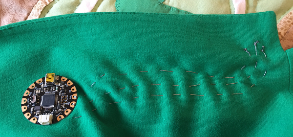
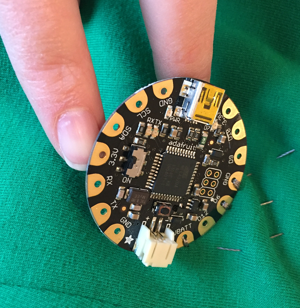
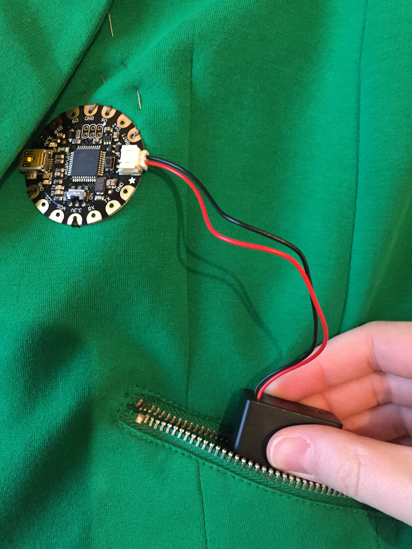
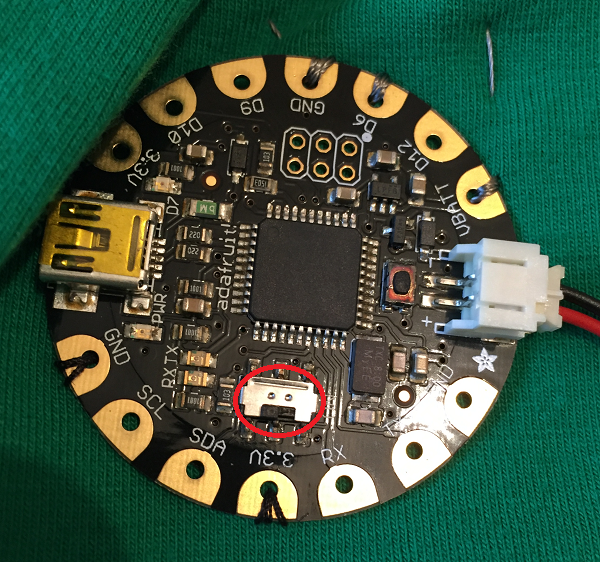
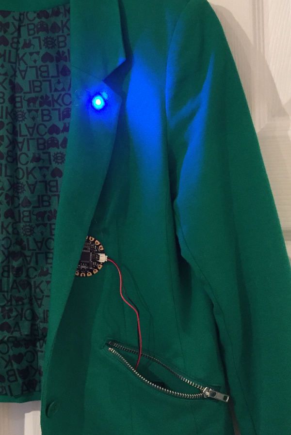

## Connect the power and D6 pin

- Now you need to repeat this process twice more:

 - Stitch `VBATT` on the FLORA to the `+` connector on the NeoPixel
 - Stitch `D6` on the FLORA to the connector with an arrow pointing **towards** the NeoPixel

 The process is exactly the same as above, except you must be careful to **ensure that the threads do not touch each other at all** or you will cause a short circuit. When you have finished sewing all three connections, your circuit might look something like this:

   

- You might feel that because we have only sewn to connectors on one side, your FLORA is not securely fastened to the item of clothing. You can easily solve this problem by sewing through some of the connectors with **normal sewing thread** (don't use conductive thread) to secure it.

   

- Now connect your battery pack up to the FLORA. If your battery pack has an on/off switch, switch it on.

   

- Finally, turn on the power switch on the FLORA; it is very small and can be found next to the connector labelled 3.3V. You should see the light pattern you programmed earlier displaying on the NeoPixel.

   

- Parade around showing off your awesome piece of wearable tech!

  

