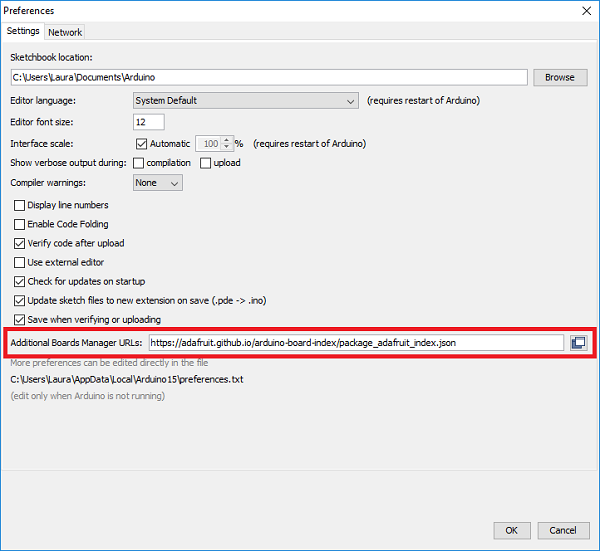
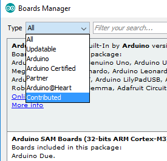
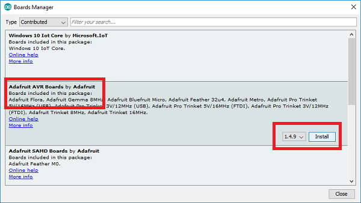

# Software Installation

To install the software you need, follow the instructions on the [Adafruit website](https://learn.adafruit.com/adafruit-arduino-ide-setup/arduino-1-dot-6-x-ide)

1. Download the Arduino IDE from the [Latest Arduino IDE link](https://learn.adafruit.com/adafruit-arduino-ide-setup/arduino-1-dot-6-x-ide) on the Adafruit website.

1. Run the Arduino IDE and click `File` > `Preferences`

1. A box will pop up. Paste this line into the box labelled "Additional Boards Manager URLs" then click `OK`

  ```bash
  https://adafruit.github.io/arduino-board-index/package_adafruit_index.jso
  ```

  

1. Now go to `Tools` > `Boards` > `Board manager`

  

1. Change the drop down on the top left to `Contributed`

  

1. Click on the category entitled **Adafruit AVR boards** and then click the `Install` button.

  

1. Close the Arduino IDE and then reopen it.

1. Finish the setup for the operating system you are using - [Windows](https://learn.adafruit.com/adafruit-arduino-ide-setup/windows-setup), [Mac OSX](https://learn.adafruit.com/adafruit-arduino-ide-setup/mac-osx-setup) or [Linux](https://learn.adafruit.com/adafruit-arduino-ide-setup/linux-setup)
