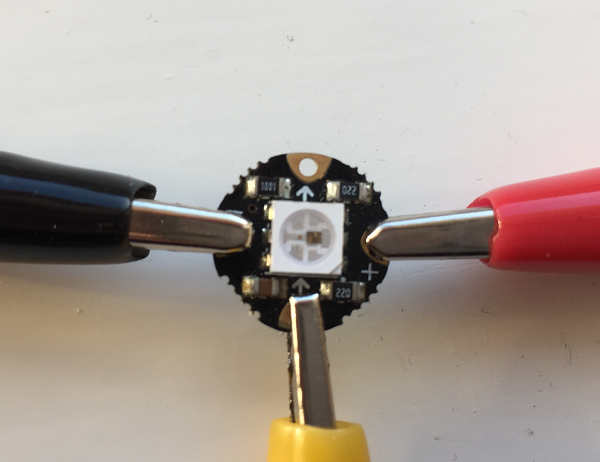

# Getting started with wearables

In this resource you will learn how to create a basic piece of wearable technology using an Adafruit FLORA and a NeoPixel LED.

1. Firstly you need to install the Arduino software which is required to program your FLORA. Instructions for installing the software can be found via the link on the [software](software.md) page.

1. Make sure you have installed the [Adafruit NeoPixel library](https://learn.adafruit.com/adafruit-neopixel-uberguide/arduino-library-installation#manually-install-adafruit-neopixel-library).

## Testing the FLORA board

We will begin by testing whether we can upload a program successfully to the FLORA board, before we move on to connecting any components.

1. Connect your FLORA board to the computer via the USB cable. The smaller end of the cable goes into the FLORA (ours is a FLORA v1 so we used a Mini USB cable, but if you have a FLORA v2 or v3 you will need a Micro USB cable). The large end of the USB cable should be connected to a USB port on your computer.

   

1. Open the Arduino IDE and check that on the Tools menu you have selected "Adafruit FLORA" as the board. On the same menu, look for the "Serial Port" option and select the port. On Windows, this will be labelled COM and then a number greater than 2 (e.g. COM3). On Mac, select a port containing the phrase "usbmodem".

  

1. If you look closely at the FLORA board you will see a small LED labelled "D7". Type the following code into the Arduino IDE to program this LED to blink repeatedly:

  ```cpp
  int led = 7;

  void setup() {
    pinMode(led, OUTPUT);
  }

  void loop() {
    digitalWrite(led, HIGH);
    delay(1000);
    digitalWrite(led, LOW);
    delay(1000);
  }
  ```

1. Click on the tick symbol in the top left of the window. This will **compile** your code, which includes checking it for errors. Any errors which you need to correct will appear at the bottom, and the line will often be highlighted in the code to help you. In the example below we have forgotten the capital 'M' in `pinMode` which has caused an error.

  

1. If there were any errors, fix them and then press the tick button again. Repeat this until you see "Done compiling" in green at the bottom and no error messages are displayed.

1. Now click on the arrow symbol which is next to the tick symbol you pressed earlier. This will **upload** your code to the FLORA. The LEDs will blink whilst the code uploads, and When the code has finished uploading you should see the red LED constantly blinking.

## Testing the circuit
Before sewing anything, it is a good idea to test the circuit with crocodile clips to check that the FLORA and the NeoPixel are working correctly and that they can be programmed. For this you will need:

- a FLORA board
- a NeoPixel
- three crocodile clips
- USB cable

We have chosen to use red, yellow, and black crocodile clips for clarity, but the colour of the wires does not matter.

1. Before you continue, **disconnect the USB cable from your FLORA** to remove the power supply. This is important to avoid accidentally causing permanent damage to your NeoPixel.

   

1. Connect a crocodile clip from GND on the FLORA to negative (-) on the NeoPixel. This provides your ground connection.

1. Connect a crocodile clip from VBATT on the FLORA to positive (+) on the NeoPixel. This provides power to the NeoPixel.

1. Connect a crocodile clip from D6 on the FLORA to the connector next to the arrow pointing **towards** the NeoPixel. D6 is a pin (just like the pins on the Raspberry Pi) which we can use to send signals to the NeoPixel.

  

  


1. Once all of the crocodile clips are in place, connect your FLORA to the computer using the USB cable.

## Controlling the NeoPixel with code

We are going to write some code to control the NeoPixel. This is slightly more complicated than controlling the on board LED because we need to use the NeoPixel library to communicate with the NeoPixel itself as it can do many more things than a normal LED.

1. In the Arduino IDE, select `File > New` to create a new program  (called a 'sketch').

1. Keep the code that is automatically inserted and add this line of code at the very start of your sketch. This will import the Adafruit NeoPixel library:

  ```cpp
  #include <Adafruit_NeoPixel.h>
  ```

1. Next we will set up the NeoPixel object. Add the following two lines of code straight after your `#include` statement
  ```cpp
  int pin = 6;
  Adafruit_NeoPixel strip = Adafruit_NeoPixel(1, pin, NEO_GRB + NEO_KHZ800);
  ```
  The first line specifies the pin to which the NeoPixel is connected. Remember when we put the crocodile clip on pin D6 earlier? We can refer to this pin just by the number `6` in the program. Other pins can be referred to by number in the same way.

  The second line sets up a "strip" of NeoPixels, with some setup information:
  - `1` - how many NeoPixels we are controlling. We are only using one in this project, but if you make a project with more NeoPixels, increase this number.
  - `pin` - the pin number the NeoPixels are connected to (from the variable `pin` we just set up)
  - `NEO_GRB + NEO_KHZ800` - this is config information for the NeoPixel RGB v2 we are using. You may need to change these values if you are using different versions of the NeoPixel. More information on other settings is available on the [Adafruit website](https://learn.adafruit.com/adafruit-neopixel-uberguide/arduino-library).

1. Now find the **setup** method which was created for you when you opened a new sketch. Change the code so that it looks like this:

  ```cpp
  void setup() {
    strip.begin();
    strip.show();
  }
  ```

  The `begin()` method allows us to start talking to the NeoPixel and the `show()` method tells the NeoPixel to update its colour. Since we haven't yet told it to be any particular colour, it will show as blank or 'off'.

1. Now to set the colour. Find the **loop** method which was also created for you in the blank sketch. Add the following code:
  ```cpp
  void loop() {

    // Blank
    strip.setPixelColor(0, 0,0,0);
    strip.show();
    delay(1000);

    // Blue
    strip.setPixelColor(0, 0,0,255);
    strip.show();
    delay(1000);

  }
  ```

  This method is called `loop()` because the code inside it will run continuously on the FLORA. Here's what this code does:

  - `strip.setPixelColor(0, 0,0,255);` - sets the pixel colour. The first number is which NeoPixel to set to this colour. Since we only have one NeoPixel in this project, it is pixel `0`. The last three numbers are a RGB colour value, so `0, 0, 255` is blue. There are lots of websites (e.g. [Adobe Color Wheel](https://color.adobe.com)) where you can find out the RGB values of particular colours.  
  - `strip.show()` - update the colour display
  - `delay(1000)` - wait for one second (1000 milliseconds)

1. Click on the tick to compile the program, and if there are no errors, connect the USB cable and then click on the arrow to upload it to your FLORA. You should see the NeoPixel flash on and off in blue.

  Can you change the colour and the speed at which the NeoPixel flashes?

Now move on to [worksheet 2](worksheet2.md) to find out how to sew your FLORA circuit into an item of clothing.
